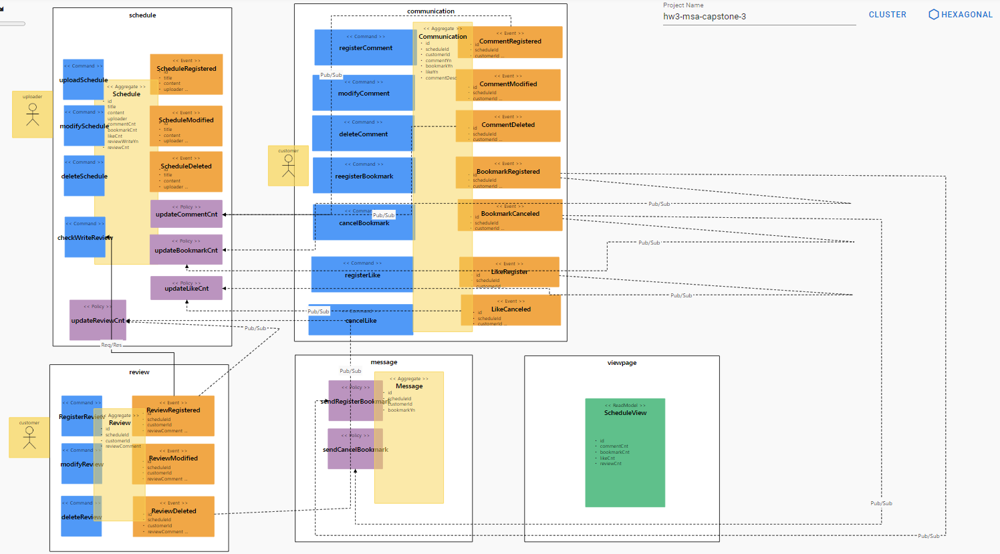

# 분석설계

#### 기능적 요구사항

- 호스트가 데이트 코스를 등록/수정/삭제한다.
- 고객이 데이트 코스에 대한 내용을 확인할 수 있다.
- 고객이 데이트 코스를 선택하여 북마크한다
- 고객이 마음에 드는 데이트 코스를 선택하여 좋아요(like)를 누른다.
- 고객이 좋아요(like)를 취소할 수 있다.
- 북마크가 되면 북마크한 내역(Message)이 전달된다.
- 고객이 북마크를 취소할 수 있다.
- 북마크가 취소될 경우 취소 내역(Message)이 전달된다.
- 고객이 데이트 코스에 대한 후기(review)를 남길 수 있다.
- 전체적인 데이트 코스에 대한 정보 및 후기 상태 등을 한 화면에서 확인 할 수 있다.(viewpage)

#### 비기능적 요구사항

- 마이크로 서비스를 넘나드는 시나리오에 대한 트랜잭션 처리
- 리뷰 작성 시 리뷰 작성이 가능한지 확인한다
- 고객이 코스(schedule) 상태를 시스템에서 확인할 수 있어야 한다 (CQRS)


### Event storming 결과

</img><br/>


### 기능적, 비기능적 요구사항 검토

</img><br/>


### 헥사고날 아키텍쳐 도출

</img><br/>


# SAGA Pattern

## 구현

서비스를 아래와 같은 방법으로 개별적으로 실행한다.

```java
cd schedule
mvn spring-boot:run
```

```java
cd communication
mvn spring-boot:run
```

```java
cd review
mvn spring-boot:run
```

```java
cd viewpage
mvn spring-boot:run
```

4개의 도메인으로 관리되고 있으며 코스관리(Schedule), 소통(Communication), 후기(Review), 코스조회(Viewpage)으로 구성된다.

```
@Entity
@Table(name = "Schedule_table")
@Data
public class Schedule {

    @Id
    @GeneratedValue(strategy = GenerationType.AUTO)
    private Long id;
    private String title;
    private String content;
    private String uploader;
    private Integer commentCnt;
    private Long bookmarkCnt;
    private Integer likeCnt;
    private Boolean reviewWriteYn;
    private Integer reviewCnt;

    @PostPersist
    public void onPostPersist() {
        ScheduleRegistered scheduleRegistered = new ScheduleRegistered(this);
        scheduleRegistered.publishAfterCommit();

        ScheduleModified scheduleModified = new ScheduleModified(this);
        scheduleModified.publishAfterCommit();

        ScheduleDeleted scheduleDeleted = new ScheduleDeleted(this);
        scheduleDeleted.publishAfterCommit();
    }
...    
```

# CQRS Pattern


### CQRS 패턴?

- CRUD에서 CUD(Command)와 R(Query)의 책임을 분리한 것이 CQRS 입니다.

## 구현

스케쥴(Schedule)의 리뷰 및 북마크 갯수 등 총 Status 에 대하여 고객(Customer)이 조회 할 수 있도록 CQRS 로 구현하였다.

- schedule, review, communication, message 개별 Aggregate Status 를 통합 조회하여 성능 Issue 를 사전에 예방할 수 있다.

- 비동기식으로 처리되어 발행된 이벤트 기반 Kafka 를 통해 수신/처리 되어 별도 Table 에 관리한다

* Schedule 등록
```
gitpod /workspace/msa-capstone-project (main) $ http POST :8082/schedules title="test" content="여의도" uploader="tester" reviewWriteYn = true
```

```
HTTP/1.1 201 Created
Connection: keep-alive
Content-Type: application/json
Date: Wed, 22 Jun 2022 04:52:26 GMT
Transfer-Encoding: chunked
location: http://localhost:8082/schedules/1
vary: Origin,Access-Control-Request-Method,Access-Control-Request-Headers
x-envoy-decorator-operation: schedule.default.svc.cluster.local:8080/*
x-envoy-upstream-service-time: 218

{
    "_links": {
        "schedule": {
            "href": "http://localhost:8082/schedules/1"
        },
        "self": {
            "href": "localhost:8082/schedules/1"
        }
    },
    "bookmarkCnt": null,
    "commentCnt": null,
    "content": "여의도",
    "likeCnt": null,
    "reviewCnt": null,
    "reviewWriteYn": true,
    "title": "test",
    "uploader": "tester"
}
```

* 카프카 consumer 이벤트 모니터링
```
/usr/local/kafka/bin/kafka-console-consumer.sh --bootstrap-server localhost:9092 --topic shopmall --from-beginning
```
```
{"eventType":"ScheduleResistered","timestamp":"20220621104951","id":1,"title":"test", "content":"여의도", uploader:"tester","commentCnt":null,"bookmarkCnt":null,"bookmarkCnt":null,"likeCnt":null, "reviewWriteYn":true, "reviewCnt":null}
```

* viewpage 서비스를 실행
```
cd viewpage
mvn spring-boot:run
```

* view의 Query Model을 통해 코스(schedule)를 통합조회 Query Model 은 발생한 모든 이벤트를 수신하여 자신만의 View로 데이터를 통합 조회 가능하게 함
```
http localhost:8083/scheduleViews/schedules/1
```
```
HTTP/1.1 200 OK
Connection: keep-alive
Content-Type: application/hal+json
Date: Wed, 22 Jun 2022 04:52:54 GMT
Transfer-Encoding: chunked
vary: Origin,Access-Control-Request-Method,Access-Control-Request-Headers
x-envoy-decorator-operation: schedule.default.svc.cluster.local:8080/*
x-envoy-upstream-service-time: 10

{
    "_links": {
        "schedule": {
            "href": "http://localhost:8083/scheduleViews/schedules/1"
        },
        "self": {
            "href": "http://localhost:8083/scheduleViews/schedules/1"
        }
    },
    "bookmarkCnt": null,
    "commentCnt": null,
    "content": "여의도",
    "likeCnt": null,
    "reviewCnt": null,
    "reviewWriteYn": true,
    "title": "test",
    "uploader": "tester"
}
```


# Correlation / Compensation(Unique Key)

## Correlation

SNS Project에서는 PolicyHandler에서 처리 시 어떤 건에 대한 처리인지를 구별하기 위한 Correlation-key 구현을 이벤트 클래스 안의 변수로 전달받아 서비스간 연관된 처리를 정확하게 구현하고 있습니다.


# Request / Response (Feign Client / Sync.Async)

```java
        // 해당 리뷰가 등록가능한 상태인지 체크
        hwmsacapstone.external.Schedule schedule = new hwmsacapstone.external.Schedule();
        boolean result = ReviewApplication.applicationContext
            .getBean(hwmsacapstone.external.ScheduleService.class)
            .checkWriteReview(schedule);
        if (result){
            // 예약 가능한 상태인 경우(Available)
            // 등록
            ReviewRegistered reviewRegistered = new ReviewRegistered(this);
            reviewRegistered.publishAfterCommit();
        }
```

### Feign Client 란?

1) Feign Client는 ***\*web service 클라이언트를 보다 쉽게 작성할 수 있도록 도와줍니다.\****
2) interface를 작성하고 annotation을 붙여주면 세부적인 내용 없이 사용할 수 있기 때문에 ***\*코드 복잡도가 낮아집니다.\****
3) ***\*Netflix\**** 에서 만들어졌고, ***\*spring-cloud-starter-openfeign\**** 으로 스프링 라이브러리에서 사용할 수 있습니다.

# Gateway

**1) gateway 서비스 포트 8080으로 지정**

```
server:
  port: 8088
```

**2) 설정 파일(application.yaml) 내 각 마이크로 서비스 route 추가**

```
spring:
  profiles: docker
  cloud:
    gateway:
      routes:
        - id: schedule
          uri: http://schedule:8080
          predicates:
            - Path=/schedules/** 
        - id: review
          uri: http://review:8080
          predicates:
            - Path=/reviews/** 
        - id: viewpage
          uri: http://viewpage:8080
          predicates:
            - Path= 
        - id: message
          uri: http://message:8080
          predicates:
            - Path=/messages/** 
        - id: communication
          uri: http://communication:8080
          predicates:
            - Path=/communications/** 
        - id: frontend
          uri: http://frontend:8080
          predicates:
            - Path=/**
      globalcors:
        corsConfigurations:
          '[/**]':
            allowedOrigins:
              - "*"
            allowedMethods:
              - "*"
            allowedHeaders:
              - "*"
            allowCredentials: true
```

**3) Kubernetes Deployment.yaml 작성**

```
apiVersion: apps/v1
kind: Deployment
metadata:
  name: gateway
  labels:
    app: gateway
spec:
  replicas: 1
  selector:
    matchLabels:
      app: gateway
  template:
    metadata:
      labels:
        app: gateway
    spec:
      containers:
        - name: gateway
          image: username/gateway:latest
          ports:
            - containerPort: 8080
```

**4) Deploy**

```
$ kubectl apply -f deployment.yaml
```

**5) Kubernetes용 Service.yaml 작성**

```
apiVersion: v1
kind: Service
metadata:
  name: gateway
  labels:
    app: gateway
spec:
  ports:
    - port: 8080
      targetPort: 8080
  selector:
    app: gateway
  type: LoadBalancer
```

**6) Service/LoadBalancer 생성하여 Gateway end point 확인**

```
$ kubectl apply -f service.yaml
$ kubectl get svc -n schedule
```

# Deploy / Pipeline

## 패키징

```shell
cd review
cd schedule
cd communication
cd message
mvn package -B -Dmaven.test.skip=true
```

## 도커라이징 이미지 빌드

```shell
docker build -t 004814395703.dkr.ecr.ca-central-1.amazonaws.com/schedule:v1 .
docker push 004814395703.dkr.ecr.ca-central-1.amazonaws.com/schedule:v1
```

## 쿠버네티스 클러스터 생성

```shell
eksctl create cluster --name msa3-user10 --version 1.19 --spot --managed --nodegroup-name standard-workers --node-type t3.medium --nodes 3 --nodes-min 1 --nodes-max 3
```

## 클러스터에 배포

```shell
kubectl create deploy review --image=004814395703.dkr.ecr.ap-northeast-2.amazonaws.com/schedule:v1
kubectl expose deploy review --port=8080
```

## 인그레스를 통한 진입점 

```shell
NAME               CLASS    HOSTS   ADDRESS                                                                      PORTS   AGE
shopping-ingress   <none>   *       a9fa41398230441f9be95fd1a3f475a0-1369196697.ca-central-1.elb.amazonaws.com   80      48m

```

## 서비스 목록 확인

```shell
NAME         TYPE           CLUSTER-IP       EXTERNAL-IP                                                                  PORT(S)          AGE
gateway      LoadBalancer   10.100.222.60    a4b2d3d20b7a74c0fa24ff77e4b57ae1-1516662203.ca-central-1.elb.amazonaws.com   8080:31625/TCP   4m11s
kubernetes   ClusterIP      10.100.0.1       <none>                                                                       443/TCP          89m
schedule     ClusterIP      10.100.248.206   <none>                                                                       8080/TCP         61s
```

## 외부에서 서버 접속 확인

</img><br/>


각 구현체 파드들은 각자의 source repository 에 구성되었고, 사용한 CI/CD 플랫폼은 AWS의 EKS를 사용하였다.
파드들은 패키지화 하여 도커 이미지 빌드 후에 배포하였고 Dockerfile에 저장되어있는 형태로 도커라이징 하여 쿠버네티스 클러스터에 배포하였다.
pipeline build script 는 각 프로젝트 폴더 이하에 cloudbuild.yml 에 포함되었다.


# Circuit Breaker


# Autoscale(HPA)

## 생성된 siege Pod 안쪽에서 정상 작동 확인

```shell
** Preparing 1 concurrent users for battle.
The server is now under siege...
HTTP/1.1 200     0.03 secs:     438 bytes ==> GET  /schedules
HTTP/1.1 200     0.03 secs:     438 bytes ==> GET  /schedules
HTTP/1.1 200     0.03 secs:     438 bytes ==> GET  /schedules
HTTP/1.1 200     0.01 secs:     438 bytes ==> GET  /schedules
```


오토 스케일링 설정명령어 호출

```shell
kubectl autoscale deployment schedule --cpu-percent=20 --min=1 --max=3
```

설정값 확인

```shell
gitpod /workspace/msa-capstone (main) $ kubectl get hpa
NAME       REFERENCE             TARGETS         MINPODS   MAXPODS   REPLICAS   AGE
schedule   Deployment/schedule   <unknown>/20%   1         3         1          48s
```

부하 명령어 확인

```shell
kubectl exec -it siege -- /bin/bash
siege -c20 -t40S -v http://a9fa41398230441f9be95fd1a3f475a0-1369196697.ca-central-1.elb.amazonaws.com/schedules
exit
```


## 오토스케일 정상 작동 확인

</img><br/>


# Self-Healing(Liveness Probe)

호출 명령어

```shell
kubectl exec -it siege -- /bin/bash
http http://a9fa41398230441f9be95fd1a3f475a0-1369196697.ca-central-1.elb.amazonaws.com/schedules/callMemleak
```

종료후 재시작 확인

</img><br/>

# Zero-Downtime Deploy(Readiness Probe)

정지시간 발생 확인

```shell
Lifting the server siege...
Transactions:                    978 hits
Availability:                  71.18 %
Elapsed time:                  23.52 secs
Data transferred:               0.44 MB
Response time:                  0.02 secs
Transaction rate:              41.58 trans/sec
Throughput:                     0.02 MB/sec
Concurrency:                    0.98
Successful transactions:         978
```


호출명령어

```shell
kubectl exec -it siege -- /bin/bash
siege -c1 -t60S -v http://a9fa41398230441f9be95fd1a3f475a0-1369196697.ca-central-1.elb.amazonaws.com/schedules
 --delay=1S
```

```shell
kubectl apply -f kubernetes/deployment.yaml
```


무중단배포 확인

</img><br/>


# Config Map / Persistence Volume

1. PersistenceVolume 으로 된 파일시스템을 사용하기 위해 fs라는 pvc 생성
```
pvc.yaml

apiVersion: v1
kind: PersistentVolumeClaim
metadata:
  name: fs
  labels:
    app: test-pvc
spec:
  accessModes:
  - ReadWriteOnce
  resources:
    requests:
      storage: 1Mi
```

2. DB접속 시 보안을 위한 secret 정보 생성 
```
deployment.yaml
---
apiVersion: v1
kind: Secret
metadata:
  name: mysql-pass
type: Opaque
data:
  password: YWRtaW4=     
```

3. mysql 설치를 위한 pod 정보 추가 및  pvc, secret 적용 (mysql은 docker hub의 최신 버전)
```
deployment.yaml
---
apiVersion: v1
kind: Pod
metadata:
  name: mysql
  labels:
    name: lbl-k8s-mysql
spec:
  containers:
  - name: mysql
    image: mysql:latest
    env:
    - name: MYSQL_ROOT_PASSWORD
      valueFrom:
        secretKeyRef:
          name: mysql-pass
          key: password
    ports:
    - name: mysql
      containerPort: 3306
      protocol: TCP
    volumeMounts:
    - name: k8s-mysql-storage
      mountPath: /var/lib/mysql
  volumes:
  - name: k8s-mysql-storage
    persistentVolumeClaim:
      claimName: "fs"

---

apiVersion: apps/v1
kind: Deployment
metadata:
  name: schedule
  labels:
    app: schedule
spec:
  replicas: 1
  selector:
    matchLabels:
      app: schedule
  template:
    metadata:
      labels:
        app: schedule
    spec:
      containers:
        - name: schedule
          image: 004814395703.dkr.ecr.ca-central-1.amazonaws.com/schedule:v1
          ports:
            - containerPort: 8080
          readinessProbe:
            httpGet:
              path: '/schedules'
              port: 8080
            initialDelaySeconds: 10
            timeoutSeconds: 2
            periodSeconds: 5
            failureThreshold: 10
          livenessProbe:
            httpGet:
              path: '/schedules'
              port: 8080
            initialDelaySeconds: 120
            timeoutSeconds: 2
            periodSeconds: 5
            failureThreshold: 5
          env:
            - name: superuser.userId
              value: userId
            - name: _DATASOURCE_ADDRESS
              value: mysql
            - name: _DATASOURCE_TABLESPACE
              value: orderdb
            - name: _DATASOURCE_USERNAME
              value: root
            - name: _DATASOURCE_PASSWORD
              valueFrom:
                secretKeyRef:
                  name: mysql-pass
                  key: password  
```

4. 변경된 사항을 반영하기 위해 deployment.yaml apply 실행 및 확인 
```
kubectl apply -f deployment.yaml
```
```
-- pod 생성 정보 확인
gitpod /workspace/msa-capstone/schedule/kubernetes (main) $ kubectl get pods
NAME                             READY   STATUS    RESTARTS   AGE
message-5cb67558c4-47hc6         2/2     Running   0          14m
mysql                            2/2     Running   0          26m
schedule-79cb59f8b-mc6b7         2/2     Running   0          71m
schedule-istio-6dbcd6ffd-fndpx   2/2     Running   0          69m
siege                            1/1     Running   0          22h

-- secret 생성 확인
gitpod /workspace/msa-capstone/schedule/kubernetes (main) $ kubectl get secrets
NAME                  TYPE                                  DATA   AGE
default-token-lmqn7   kubernetes.io/service-account-token   3      2d
mysql-pass            Opaque                                1      75m
```

5. mysql db 활성화
```
gitpod /workspace/msa-capstone/schedule/kubernetes (main) $ kubectl exec mysql -it -- bash
root@mysql:/# mysql --user=root --password=$MYSQL_ROOT_PASSWORD
mysql> show databases
    -> ;
+--------------------+
| Database           |
+--------------------+
| information_schema |
| mysql              |
| performance_schema |
| sys                |
+--------------------+
4 rows in set (0.00 sec)

mysql> create database scheduledb;
Query OK, 1 row affected (0.00 sec)

mysql> show databases;
+--------------------+
| Database           |
+--------------------+
| information_schema |
| mysql              |
| performance_schema |
| scheduledb         |
| sys                |
+--------------------+
5 rows in set (0.00 sec)

```

6. 코스(schedule)  생성
```
gitpod /workspace/msa-capstone/schedule (main) $ http acfb969d1926a46a98fb8847915140c3-1081140102.ca-central-1.elb.amazonaws.com/schedules title="DBTest" content="testtest"
HTTP/1.1 201 Created
Connection: keep-alive
Content-Type: application/json
Date: Wed, 22 Jun 2022 04:52:26 GMT
Transfer-Encoding: chunked
location: http://acfb969d1926a46a98fb8847915140c3-1081140102.ca-central-1.elb.amazonaws.com/schedules/1
vary: Origin,Access-Control-Request-Method,Access-Control-Request-Headers
x-envoy-decorator-operation: schedule.default.svc.cluster.local:8080/*
x-envoy-upstream-service-time: 218

{
    "_links": {
        "schedule": {
            "href": "http://acfb969d1926a46a98fb8847915140c3-1081140102.ca-central-1.elb.amazonaws.com/schedules/1"
        },
        "self": {
            "href": "http://acfb969d1926a46a98fb8847915140c3-1081140102.ca-central-1.elb.amazonaws.com/schedules/1"
        }
    },
    "bookmarkCnt": null,
    "commentCnt": null,
    "content": "testtest",
    "likeCnt": null,
    "reviewCnt": null,
    "reviewWriteYn": null,
    "title": "DBTest",
    "uploader": null
}
```

7.mysql pod 삭제 후 재실행
```
kubectl delete pod mysql
kubectl apply -f 4.deployment.yaml
```

8.mysql 삭제 후 재실행 하기 전 코스(schedule) 존재 확인
```
gitpod /workspace/msa-capstone/schedule (main) $ http acfb969d1926a46a98fb8847915140c3-1081140102.ca-central-1.elb.amazonaws.com/schedules/1
HTTP/1.1 200 OK
Connection: keep-alive
Content-Type: application/hal+json
Date: Wed, 22 Jun 2022 04:55:15 GMT
Transfer-Encoding: chunked
vary: Origin,Access-Control-Request-Method,Access-Control-Request-Headers
x-envoy-decorator-operation: schedule.default.svc.cluster.local:8080/*
x-envoy-upstream-service-time: 5

{
    "_links": {
        "schedule": {
            "href": "http://acfb969d1926a46a98fb8847915140c3-1081140102.ca-central-1.elb.amazonaws.com/schedules/1"
        },
        "self": {
            "href": "http://acfb969d1926a46a98fb8847915140c3-1081140102.ca-central-1.elb.amazonaws.com/schedules/1"
        }
    },
    "bookmarkCnt": null,
    "commentCnt": null,
    "content": "testtest",
    "likeCnt": null,
    "reviewCnt": null,
    "reviewWriteYn": null,
    "title": "DBTest",
    "uploader": null
}

```

# Polyglot
